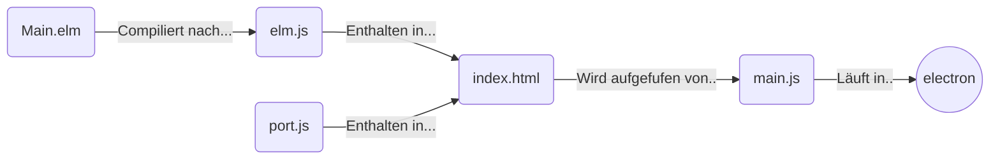

# Electron Elm "Hallo Welt"

_Die Installation von Elm und Electron wird hier vorausgesetzt._

Für das Minibeispiel benötigen wir folgende Dateien.  
  - package.json
  - main.js
  - ports.js
  - index.html
  - Main.elm



## Electron

Die Datei `package.json` gibt **Electron** an, welche Hauptdatei aufgerufen wird, die Prgrammdetails und die Abhängigkeiten.

```
{
  "name": "elm-electron-hallo-welt",
  "version": "1.0.0",
  "description": "Ein kleines Elm mit Electron Programm",
  "main": "main.js",
  "scripts": {
    "elm": "elm make Main.elm --output elm.js || true",
    "elm:watch": "chokidar '**/*.elm' -c 'npm run elm'",
    "start": "electron main.js",
    "watch": "npm run start & npm run elm:watch & wait"
  },
  "repository": {
    "type": "git",
    "url": "git+https://github.com/fulnir/elm-electron-hallo-welt.git"
  },
  "keywords": [
    "Elm",
    "Electron",
    "quick",
    "start",
    "tutorial",
    "german",
    "deutsch"
  ],
  "author": "Fulnir",
  "license": "CC0-1.0",
  "bugs": {
    "url": "https://github.com/fulnir/elm-electron-hallo-welt/issues"
  },
  "homepage": "https://github.com/fulnir/elm-electron-hallo-welt#readme",
  "devDependencies": {
    "electron-prebuilt": "^0.36.0"
  }
}
```

## Main Script

Zunächst wird das Hauptscript `main.js` benötigt. Hiermit wird ++Electron** gestartet. 

```
'use strict'
const electron = require('electron')

const app = electron.app // this is our app
const BrowserWindow = electron.BrowserWindow // This is a Module that creates windows  

let mainWindow // saves a global reference to mainWindow so it doesn't get garbage collected

app.on('ready', createWindow) // called when electron has initialized

// This will create our app window, no surprise there
function createWindow () {
  mainWindow = new BrowserWindow({
    width: 1024, 
    height: 768
  })

  // display the index.html file
  mainWindow.loadURL(`file://${ __dirname }/index.html`)
  
  // open dev tools by default so we can see any console errors
  mainWindow.webContents.openDevTools()

  mainWindow.on('closed', function () {
    mainWindow = null
  })
}

/* Mac Specific things */

// when you close all the windows on a non-mac OS it quits the app
app.on('window-all-closed', () => {
  if (process.platform !== 'darwin') { app.quit() }
})

// if there is no mainWindow it creates one (like when you click the dock icon)
app.on('activate', () => {
  if (mainWindow === null) { createWindow() }
})
```

## Html 

Die Datei `index.html` wird von **Electron** dargestellt. Sie enthält den `div container`der den Inhalt des Elmprogramms rendert. Uaußerdem ruft er das  Script `port.js`auf.

```
<html>
	
  <head>
    <!-- Der Titel für die Fensterleiste -->
    <title>Elm Electron Beispiel</title>
  </head>

  <body>
    <!-- In dieses div wird das Elmprogramm gerendert -->
    <div id="container"></div>
  </body>

  <!-- und das Script ports.js starten, das seinerseits die elm app startet -->
  <script type="text/javascript" src="ports.js"></script>

</html>
```

# ports.js

Dieses  Script startet unser Elmprogramm und sorgt für dessen Verbindung zum `div container`.

```
'use strict'
const Elm = require('./elm.js')

// Die Reference zum Element container
let container = document.getElementById('container')

// Startet die elm app im container
let myapp = Elm.Main.embed(container)
```

## Elm

Das kleine Elmprogramm, in der Datei `Main.elm`, ist das übliche `Hallo Welt` Programm.
Hier wird das Nutzerinterface programmiert, das dann mit `elm-make` zu dem Javascriptprogramm `elm.js` kompiliert wird.

```
module Main exposing (..)

import Html

main : Html.Html msg
main =
    Html.text "Hallo Welt"
```

Die Datei `Main.elm` muß nun noch zu `elm.js` kompiliert werden.

    $ elm make Main.elm --output elm.js

Das Electronbeispiel wird gestartet mit:

    $ electron main.js


#### Links
Dieses Beispiel basiert auf [medium.com/@ezekeal/building-an-electron-app-with-elm-part-1-boilerplate](https://medium.com/@ezekeal/building-an-electron-app-with-elm-part-1-boilerplate-3416a730731f)

[Electron](https://electron.atom.io)
[Elm](http://elm-lang.org)